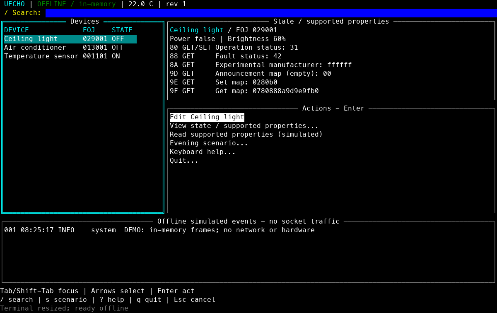

# uecho-simulator

A small ECHONET Lite room simulator powered by [uecho-go](https://github.com/cybergarage/uecho-go). It runs on Mac/Linux and Raspberry Pi 4/5 without extra equipment. Raspberry Pi Pico is outside this project's scope.

The default mode is fully offline: requests are encoded, decoded and handled in memory. It opens no sockets, discovers no devices and sends no advertisements. The prototype implements explicit small profiles, not complete ECHONET Lite/MRA compliance.

## Quick start

Install Go 1.25 or later and Make, then:

```sh
git clone git@github.com:cybergarage/uecho-simulator.git
cd uecho-simulator
go mod download
make help
make preview
make tui
```

`make tui` starts the interactive full-screen UI. `make preview` generates room.svg from the offline evening scenario and exits; `make demo` prints that scenario and exits without generating a preview. `make help` lists these four targets. Go commands use the pinned dependency with `GOWORK=off`. Generated room.svg is ignored by Git.

Open room.svg in a browser or image viewer. It is a static 800×480 black/white room and state view. The SVG file updates after local terminal commands; reload the viewer to see the latest state. No web server or hardware refresh loop is included.

## Full-screen terminal UI

The default command starts a selection-based [tview](https://github.com/rivo/tview)/[tcell](https://github.com/gdamore/tcell) dashboard. It shows devices, selected state/properties, available actions and an explicitly labelled offline simulated-event log. No command string is required for device operation.



[Device form](docs/images/tui-form.png) · [Compact layout](docs/images/tui-compact.png). These images come from real tcell widget drawing in the simulation-screen tests, rather than a visual mockup.

| Key | Action |
| --- | --- |
| Tab / Shift-Tab | Cycle Devices → Actions → Events; cyan border marks focus |
| Up / Down | Select a device/action or scroll events |
| Enter | From Devices, focus Actions; from Actions, open a form/menu |
| `/` | Search device name, kind or EOJ; Enter returns to Devices |
| Esc | Cancel a dialog without applying; outside dialogs clear search / focus Devices |
| `s` | Open evening-scenario confirmation (Cancel is selected first) |
| `?` | Open keyboard help (arrows scroll; Tab reaches Close) |
| `q` / Ctrl-C | Open quit confirmation; Esc cancels it |

In forms, Tab/Shift-Tab moves between fields and buttons, Space toggles Power, and Enter opens/selects a mode dropdown or activates Apply/Cancel. Brightness and AC target use numeric fields. Temperature sensor EPC E0 remains read only: its form changes a **local ambient scenario input**, not a protocol write. Input validation happens before any state mutation.

`demo` applies the deterministic evening scenario: light on at 75%, air conditioner on in cool mode at 24°C, room temperature 26.5°C. Use `s` and confirm it in the TUI, or use `--demo` for a non-interactive run. Temperature is injected; no thermodynamic model runs in the background.

At widths below 85 columns or heights below 26 rows, the UI stacks Devices and Actions and reduces the log pane. The wide property pane is available through **View state / supported properties**. Selection and open forms survive resize; dialogs are constrained to terminal bounds. Use at least 45×18 (85×26 or larger recommended). Smaller screens remain cancellable but may clip content. Mouse navigation is currently disabled. Exit through the confirmation dialog; tcell restores the terminal's normal screen/input mode.

## Non-interactive / plain mode

The offline demo and SVG export remain available for automation:

```sh
make demo
make preview
```

`--plain` retains the earlier line interface for piped input, rather than opening a full-screen UI:

```sh
printf 'light on\nac cool\ntemp 26.5\nquit\n' | go run ./cmd/uecho-simulator --plain
```

In-memory frames are labelled `SIM-RX`/`SIM-TX`; these are simulated events, not socket captures. The standard TUI is offline only. Optional loopback UDP is available exclusively through explicit `--udp ... --plain`; it has not been exercised in this work.

## Implemented profiles

| Device | EOJ | Properties beyond common status/maps |
| --- | --- | --- |
| General lighting | 029001 | B0: brightness 0–100% |
| Home air conditioner | 013001 | B0: cool/heat/fan; B3: target 16–30°C; BB: room temperature |
| Temperature sensor | 001101 | E0: signed big-endian temperature in 0.1°C, read only |

Common EPCs: 80 operation status, 88 fault status, 8A experimental manufacturer value FFFFFF, 9D empty announcement map, 9E Set map, 9F Get map. Maps describe only implemented properties and currently fit Format 1. No full MRA object/property set is inherited. Get and SetC are supported, including error responses and multiple-property frames. Rejected individual writes do not change their state; a multi-property request may apply valid writes before returning an error for another property.

Not implemented: node profile/discovery, INF notifications, SetI/SetGet, complete MRA conformance, device persistence, live web UI, physical appliances, Sense HAT/e-paper drivers or automatic display refresh. The sensor always reports powered on and cannot be written over the protocol.

## Optional loopback transport

Networking is disabled unless explicitly requested:

```sh
go run ./cmd/uecho-simulator --udp 127.0.0.1:3610 --plain
```

This prototype accepts only a literal IPv4 loopback bind. Wildcard, multicast, hostname and LAN addresses are refused. It responds only to received requests and does not scan or advertise. UDP mode is excluded from `--demo`. The optional transport has address-policy tests; actual socket interaction has not been exercised in this task. UDP state changes appear at the next terminal redraw; they do not trigger automatic preview refresh. Exit with `quit` or Ctrl-C.

## Raspberry Pi 4/5

Use a 64-bit Raspberry Pi OS/Linux installation and a Go 1.25+ arm64 toolchain. No GPIO, SPI, HAT configuration or privilege changes are needed for the offline demo. The repository is private, so use an existing authorized GitHub credential for checkout.

On a Mac or Linux development machine, build the portable binary:

```sh
mkdir -p bin
GOOS=linux GOARCH=arm64 CGO_ENABLED=0 go build -o bin/uecho-simulator-linux-arm64 ./cmd/uecho-simulator
```

After transferring it through your existing authorized workflow, run `./uecho-simulator-linux-arm64 --demo --plain --preview room.svg` on the Pi. Physical Pi execution is not yet verified; the arm64 binary is cross-built in CI. No additional screen or sensor is required.

## Architecture and development

- `internal/model`: synchronized virtual state and detached snapshots; no network or hardware.
- `internal/wire`: uecho-go frame handling plus optional transport.
- `internal/tui`: full-screen selection UI, legacy plain interface and deterministic scenario.
- `internal/display`: `Adapter.Render(snapshot) -> Frame`; SVG is the initial adapter. Future Sense HAT rev2/e-paper adapters own pixel conversion, refresh intervals and batching without changing model/protocol code.
- `cmd/uecho-simulator`: explicit runtime modes and lifecycle.

uecho-go is pinned to the merged property-map fix; no local replace is committed. To develop both libraries together, create an untracked workspace outside the repositories:

```sh
cd ~/Src
go work init ./uecho-go ./uecho-simulator
```

CI sets `GOWORK=off` to check the pinned dependency rather than a local checkout. Remove/disable your local workspace when validating the released dependency.

```sh
./scripts/check.sh
```

Checks include formatting, vet, tests/race (including tcell keyboard events, form apply/cancel, search targeting, resize and screen finalization), darwin/arm64 and linux/arm64 builds, and an offline SVG demo. Tests use in-memory frames and never call the UDP listener. CI denies network access during checks after downloading dependencies. The initial work-in-progress archive remains preserved separately; no source-library checkout was modified during migration.

BSD 3-Clause; see LICENSE and THIRD_PARTY_NOTICES.md.

## UI references

Navigation and visible key hints were informed by the official [k9s README](https://github.com/derailed/k9s) and [command guide](https://k9scli.io/topics/commands/). Widget composition follows the official [tview README](https://github.com/rivo/tview) and [form example](https://github.com/rivo/tview/blob/master/demos/form/main.go). No Kubernetes functionality or k9s code/assets are included. tview/tcell and transitive runtime versions are fixed in go.mod/go.sum; their upstream notices are in THIRD_PARTY_NOTICES.md.
