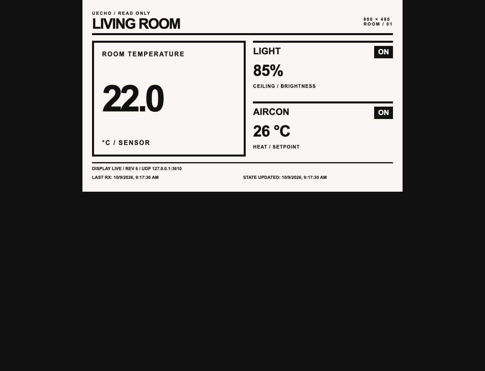

# uecho-simulator

A small ECHONET Lite room simulator powered by [uecho-go](https://github.com/cybergarage/uecho-go). It runs on Mac/Linux and Raspberry Pi 4/5 without extra equipment. Raspberry Pi Pico is outside this project's scope.



Normal startup enables IPv4 ECHONET UDP and multicast on one selected network interface. Use `--offline` to open no ECHONET sockets or advertisements. The virtual profiles target ECHONET Lite v1.14 and Appendix Release R rev.4. See the supported properties and transport modes below; this is not a certified appliance or an implementation of the entire MRA.

## Quick start

Install Go 1.25 or later and Make, then:

```sh
git clone https://github.com/cybergarage/uecho-simulator.git
cd uecho-simulator
go mod download
make preview
```

`make tui` starts the interactive full-screen UI. `make preview` keeps a read-only browser display running; `make export` generates room.svg and exits; `make demo` prints the evening scenario and exits. `make help` lists all five targets. Go commands use the pinned dependency with `GOWORK=off`. Generated room.svg is ignored by Git.

## Full-screen terminal UI

The default command starts a selection-based [tview](https://github.com/rivo/tview)/[tcell](https://github.com/gdamore/tcell) dashboard. It shows devices, selected state/properties, available actions and a simulated-event and UDP log. No command string is required for device operation.


[Device form](docs/images/tui-form.png) · [Compact layout](docs/images/tui-compact.png). These images come from real tcell widget drawing in the simulation-screen tests, rather than a visual mockup.

| Key | Action |
| --- | --- |
| Tab / Shift-Tab | Cycle Devices → Actions → Events; cyan border marks focus |
| Up / Down | Select a device/action or scroll events |
| Enter | From Devices, focus Actions; from Actions, open a form/menu |
| `/` | Search device name, kind or EOJ; Enter returns to Devices |
| Esc | Cancel a dialog without applying; outside dialogs clear search / focus Devices |
| `s` | Open evening-scenario confirmation (Cancel is selected first) |
| `?` | Open keyboard help (arrows scroll; Tab reaches Close) |
| `q` / Ctrl-C | Open quit confirmation; Esc cancels it |

In forms, Tab/Shift-Tab moves between fields and buttons, Space toggles Power, and Enter opens/selects a mode dropdown or activates Apply/Cancel. Brightness and AC target use numeric fields. Temperature sensor EPC E0 remains read only: its form changes a **local ambient scenario input**, not a protocol write. Input validation happens before any state mutation.

`demo` applies the deterministic evening scenario: light on at 75%, air conditioner on in cool mode at 24°C, room temperature 26.5°C. Use `s` and confirm it in the TUI, or use `--demo` for a non-interactive run. Temperature is injected; no thermodynamic model runs in the background.

At widths below 85 columns or heights below 26 rows, the UI stacks Devices and Actions and reduces the log pane. The wide property pane is available through **View state / supported properties**. Selection and open forms survive resize; dialogs are constrained to terminal bounds. Use at least 45×18 (85×26 or larger recommended). Smaller screens remain cancellable but may clip content. Mouse navigation is currently disabled. Exit through the confirmation dialog; tcell restores the terminal's normal screen/input mode.

## Read-only browser preview

```sh
make preview
```

Open **http://127.0.0.1:8080/** in a browser on the same Mac or Pi. The bold English display is designed for 800×480 and has no device controls. It shows initial simulated values until controller input arrives. Preview stays running even without incoming events; it does not read line commands or exit at stdin EOF. A real terminal is required for its keys.

These keys work in the **launching terminal**, not the browser:

| Key | Action |
| --- | --- |
| `q` / Ctrl-C | Stop HTTP/UDP, close streams and restore terminal mode |
| `?` | Show key help |
| `r` | Re-send the current model to all displays without changing devices |
| `s` | Save the current state as room.svg using the existing static scene adapter |

The browser receives snapshots through Server-Sent Events when the shared model changes, rather than polling. Reconnecting displays immediately receive the latest state. `DISPLAY DISCONNECTED` retains last values while reconnecting. `DISPLAY LIVE` describes the browser stream, **not controller connectivity**. UDP is connectionless: the display reports whether a frame has arrived and the last RX time; it never claims a controller is connected. The state timestamp changes only on a state mutation. Read requests and invalid frames can update RX without changing state. No artificial temperature evolution runs.


This screenshot is from the actual local browser. The supplied visual reference could not be downloaded (Library returned HTTP 403); this design implements the requested bold English style without claiming to match that unseen image.

### Controller input

`make preview` and `make tui` enable UDP **3610** and join **224.0.23.0:3610** on one usable interface. A single interface is selected automatically. With several interfaces, startup shows their names and IPv4 addresses, focuses the first, and accepts Up/Down, Enter to start, or Esc to cancel. No interface means startup fails with an explanation. IPv6-only, loopback, down and non-multicast interfaces are excluded. When an interface has multiple IPv4 addresses, its sorted first address is used.

For unattended startup with several interfaces, select one explicitly:

```sh
make preview PREVIEW_ARGS='--interface en0'
```

Headless startup never publishes on every interface. For an offline browser display:

```sh
make preview PREVIEW_ARGS='--offline'
```

HTTP stays at loopback; open the browser on the simulator machine. Networking answers incoming unicast and multicast requests, sends a D5 instance-list INF at startup, and sends required status-change INF and successful INF_REQ results to the group. It never sends discovery requests. Responses use the sender's IP at UDP port **3610**. Unknown EOJs receive no response; instance 00 expands to matching concrete instances.

Legacy `--udp 127.0.0.1:3610` remains unicast only. `--udp LOCAL_IP:3610 --allow-lan` selects LAN unicast only; adding `--multicast-interface NAME` joins the group on that interface. These options work in preview, TUI and plain mode. `--interface` replaces the three flags for normal multicast use. Offline/demo flags cannot combine with network flags. Notification queue overflow stops the transport with an error.

SetC/SetI/SetGet update the shared model shown in the display; Get and INF_REQ read it. Sensor temperature remains read only over ECHONET. The temperature scenario emits sensor E0 and AC BB notifications. This work tested injected multicast paths and real localhost sockets only; Ubuntu CI additionally exercises OS multicast membership/startup/discovery on a dummy interface in an isolated network namespace. Physical interfaces, macOS multicast, household LAN and physical appliances have not been exercised.

A browser has no mutation or shutdown endpoint. The LAN UDP prototype has no authentication, so use only the intended test network and stop it from the launching terminal afterward. No firewall or permissions are changed by the program.

## Non-interactive / plain mode

The offline demo and SVG export remain available for automation:

```sh
make demo
make export
```

`--plain` retains the earlier line interface for piped input, rather than opening a full-screen UI:

```sh
printf 'light on\nac cool\ntemp 26.5\nquit\n' | go run ./cmd/uecho-simulator --offline --plain
```

In-memory frames are labelled `SIM-RX`/`SIM-TX`; these are simulated events, not socket captures. TUI and plain mode use the same network selection as preview; `--offline` explicitly disables networking. Demo/export and `--help` need no network interface.

## Implemented profiles

The normative basis is [ECHONET Lite v1.14 Part II](https://echonet.jp/wp/wp-content/uploads/pdf/General/Standard/ECHONET_lite_V1_14_en/ECHONET-Lite_Ver.1.14(02)_E.pdf) (services, instance 00, UDP addressing and node startup) and [Appendix Release R rev.4](https://echonet.jp/wp/wp-content/uploads/pdf/General/Standard/Release/Release_R/Appendix_Release_R_rev4_E.pdf) (device superclass, 0290, 0130, 0011 and 0EF0). The implementation uses explicit virtual profiles and does not inherit all optional properties from MRA.

| Object | EOJ | Class-specific properties | Set | Change INF |
| --- | --- | --- | --- | --- |
| Node profile | 0EF001 | D3 instance count; D4 class count including profile; D5/D6 device instance lists; D7 device class list | None | D5 on multicast startup |
| General lighting | 029001 | B0 brightness 0–100%; B6 main lighting (42) only | B0, B6 | B0 |
| Home air conditioner | 013001 | 8F power saving; A0 airflow auto/1–8; B0 other/auto/cool/heat/dry/fan; B3 target 0–50°C; BB signed room temperature | 8F, A0, B0, B3 | 8F, A0, B0, B3, BB |
| Temperature sensor | 001101 | E0 signed big-endian temperature in 0.1°C | None | E0 |

Device common EPCs are 80 operation status, 81 installation location (one-byte code or 17-byte position), 82 standard version (`00005204`: R revision 4), 83 identification, 88 fault status (no fault), 8A manufacturer, and 9D/9E/9F announcement/Set/Get maps. Operation status is writable for light/AC; the sensor is always on and read only. Location is writable for all three. Required change announcements cover 80/81/88; fixed read-only properties never change during a process. Optional announced properties are listed above. Node common EPCs are 80, 82 (`010e0100`: middleware 1.14, Format 1), 83, 8A and the three maps; node status is always on and read only. Maps declare precisely the supported access/announcement behavior, using property-map Format 1 below 16 entries and Format 2 at 16 or more. This is distinct from the Format 1 ECHONET frame header.

D3 reports three devices; D4 reports four classes including the node profile. D5/D6 contain the three device EOJs; D7 contains their three class codes. Identification is generated once per process with an experimental FFFFFF manufacturer prefix and remains stable until restart. It is not an assigned manufacturer identity. The optional automatic-temperature-control function is absent, so B3 writes accept only numeric 0–50°C; FD is rejected rather than inventing an indeterminable target. State is volatile; the simulator does not persist controller writes or simulate heating/cooling physics, timers, automatic lighting or color lighting.

| Request | Success | Failure / behavior |
| --- | --- | --- |
| SetI 60 | No response | SetI_SNA 50; successful individual writes still apply |
| SetC 61 | Set_Res 71 | SetC_SNA 51 |
| Get 62 | Get_Res 72 | Get_SNA 52; unsupported EPCs have PDC 0 |
| INF_REQ 63 | INF 73 (multicast in multicast mode) | INF_SNA 53 (unicast) |
| SetGet 6E | SetGet_Res 7E, separate Set/Get OPC blocks | SetGet_SNA 5E; writes are processed before reads |
| INFC 74 | INFC_Res 7A with the same EPCs and PDC 0 | Unknown destination is ignored; receiving INFC does not write our model |

Multiple properties and partial failures are supported. Valid writes may apply even if another property is rejected; these requests are not transactions. Malformed/trailing/oversized input is rejected before state mutation. Responses are bounded to 1024 bytes; if values would exceed the limit, a processed prefix is returned as SNA. Incoming responses and INF do not trigger response loops. uecho-go supplies the message/property codec; a small adapter represents SetGet's two property blocks because the pinned Message API exposes one block.

Not implemented: IPv6 transport, every optional MRA property, appliance certification, persistent state, real appliances, Sense HAT/e-paper drivers. Physical Raspberry Pi and multicast on real interfaces remain unverified.

## Optional loopback transport

For manually addressed loopback unicast:

```sh
go run ./cmd/uecho-simulator --udp 127.0.0.1:3610 --plain
```

This legacy loopback mode accepts a literal IPv4 address. LAN and multicast use the common options above; wildcard and hostname binds are refused. It does not scan or send startup advertisements. Responses and notifications target port 3610. UDP mode is excluded from `--demo`. The legacy plain interface redraws on local commands; use the browser preview for event-driven updates from UDP. Exit with `quit` or Ctrl-C.

## Raspberry Pi 4/5

Use a 64-bit Raspberry Pi OS/Linux installation and a Go 1.25+ arm64 toolchain. No GPIO, SPI, HAT configuration or privilege changes are needed for the offline demo. The repository is public; HTTPS checkout needs no private-repository credential.

On a Mac or Linux development machine, build the portable binary:

```sh
mkdir -p bin
GOOS=linux GOARCH=arm64 CGO_ENABLED=0 go build -o bin/uecho-simulator-linux-arm64 ./cmd/uecho-simulator
```

After transferring it through your existing authorized workflow, run `./uecho-simulator-linux-arm64 --demo --plain --preview room.svg` on the Pi. Physical Pi execution is not yet verified; the arm64 binary is cross-built in CI. No additional screen or sensor is required.

## Architecture and development

- `internal/model`: synchronized virtual state and detached snapshots; no network or hardware.
- `internal/wire`: uecho-go frame handling plus optional transport.
- `internal/tui`: full-screen selection UI, legacy plain interface and deterministic scenario.
- `internal/preview`: read-only loopback HTTP/SSE display and terminal lifecycle keys.
- `internal/display`: `Adapter.Render(snapshot) -> Frame`; SVG is the initial adapter. Future Sense HAT rev2/e-paper adapters own pixel conversion, refresh intervals and batching without changing model/protocol code.
- `cmd/uecho-simulator`: explicit runtime modes and lifecycle.

uecho-go is pinned to the merged property-map fix; no local replace is committed. To develop both libraries together, create an untracked workspace outside the repositories:

```sh
cd ~/Src
go work init ./uecho-go ./uecho-simulator
```

CI sets `GOWORK=off` to check the pinned dependency rather than a local checkout. Remove/disable your local workspace when validating the released dependency.

```sh
./scripts/check.sh
```

Checks include formatting, vet, tests/race (including tcell keyboard events, form apply/cancel, search targeting, resize and screen finalization), darwin/arm64 and linux/arm64 builds, and an offline SVG demo. Default checks use injected frames and deny network access. The separate opt-in `SIMULATOR_LOOPBACK_TEST=1 GOWORK=off go test -race ./internal/preview -run TestLoopbackControllerToDisplay` binds only 127.0.0.1 and verifies UDP request/response, model propagation, event delivery and shutdown. CI denies network access during checks after downloading dependencies, then runs the opt-in socket test in a separate Linux network namespace with only loopback enabled, plus IPv4 multicast integration on a dummy interface in another isolated namespace. Injected multicast tests cover startup, discovery, response addressing, notifications and shutdown without host sockets. The initial work-in-progress archive remains preserved separately; no source-library checkout was modified during migration.

Release preparation, package reproducibility and verification limits are recorded in [docs/RELEASE.md](docs/RELEASE.md).
